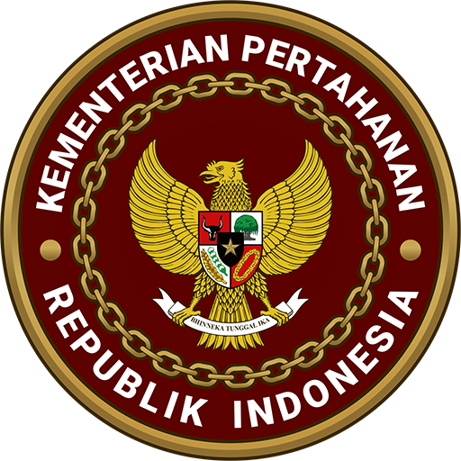

<div align="center">
  
  <h1>Kementerian Pertahanan Republik Indonesia<br/>(Static Website Project)</h1>
  <p>
    Tugas Mata Kuliah Pemrograman Web 1 | <em>Web Programming 1 Course Assignment</em>
  </p>
  <p>
    <a href="https://web-statis-kementerian-pertahanan.vercel.app/"><strong>Lihat Live Demo / View Live Demo</strong></a>
  </p>
</div>

---

## 🇮🇩 Bahasa Indonesia

Website statis ini adalah sebuah *mockup* atau *prototype* antarmuka pengguna (UI) untuk **Kementerian Pertahanan Republik Indonesia**, yang dibangun sebagai bagian dari tugas mata kuliah **Pemrograman Web 1 (Semester 2)**. Proyek ini mendemonstrasikan implementasi antarmuka web modern, interaktif, dan responsif dengan menggunakan teknologi dasar pengembangan web.

### 🌟 Fitur Utama
*   **Beranda Dinamis**: Menampilkan ringkasan informasi, *slider* spanduk interaktif, dan video profil singkat kementerian. Tersedia dua tampilan berbeda (untuk tamu tamu non-login dan pengguna yang sudah masuk).
*   **Portal Berita Terkini**: Halaman berita yang tertata rapi menggunakan tata letak *grid* (Grid Layout) dengan fitur kategori interaktif dan navigasi halaman berita.
*   **Profil Kementerian**: Halaman khusus yang menyajikan informasi sejarah, visi misi, serta struktur kepemimpinan kementerian.
*   **Layanan Pengaduan Publik (LAPOR)**: Halaman formulir pengaduan publik dengan desain UI/UX yang profesional dan mudah digunakan.
*   **Sistem Autentikasi Antarmuka (UI)**: Halaman prototipe untuk proses *Login*, *Sign Up*, serta antarmuka manajemen profil akun (*Dashboard* Akun).
*   **Desain Modern & Animasi**: Penggunaan palet warna yang premium (Merah Marun & Kuning Emas), efek *hover* yang halus, efek *glassmorphism*, dan tipografi yang elegan agar terlihat layaknya situs pemerintah profesional.

### 🛠️ Teknologi yang Digunakan
*   **HTML5**: Menggunakan semantik HTML untuk struktur dasar.
*   **CSS3 (Vanilla)**: Menggunakan gaya murni (Vanilla CSS) tanpa *framework* (seperti Bootstrap/Tailwind) dengan implementasi tingkat lanjut seperti Flexbox, CSS Grid, dan *backdrop-filter*.
*   **JavaScript (Vanilla)**: Digunakan untuk fungsi interaktif ringan seperti animasi, *slider* halaman berita, dan validasi fungsional lokal.

### 📂 Struktur Proyek
```text
├── asset/          # Gambar, logo, ikon, dan media pendukung lainnya
├── css/            # Semua file styling (.css) yang dipisah tiap komponen
├── js/             # Script interaktif dasar (Slider, Modal, Navbar interaktif)
├── index.html      # Halaman utama (Dashboard pengguna)
├── berandanonlogin.html # Halaman utama pengunjung
├── login.html      # Halaman portal masuk (Login)
└── ...             # Halaman statis pendukung lainnya (profil, berita, dll)
```

---

## 🇬🇧 English

This static website is a user interface (UI) mockup or prototype for the **Ministry of Defense of the Republic of Indonesia**, built as part of the **Web Programming 1 (2nd Semester)** course assignment. This project demonstrates the implementation of a modern, interactive, and responsive web interface using foundational web development technologies.

### 🌟 Key Features
*   **Dynamic Homepage**: Features a summary of information, an interactive banner slider, and a short ministry profile video. It includes two distinct views (for non-logged-in guests and authenticated users).
*   **Latest News Portal**: A neatly organized news page using a grid layout with interactive category chips and news pagination.
*   **Ministry Profile**: A dedicated page presenting historical information, vision and mission, and the ministry's leadership structure.
*   **Public Complaint Service (LAPOR)**: A public grievance form page featuring a professional and user-friendly UI/UX design.
*   **Authentication UI System**: Mockup interfaces for *Login*, *Sign Up*, and account profile management dashboard.
*   **Modern Design & Animations**: Utilizing a premium color palette (Maroon Red & Golden Yellow), smooth hover transitions, glassmorphism effects, and elegant typography to emulate a professional government portal.

### 🛠️ Technologies Used
*   **HTML5**: Utilizing semantic HTML for the core structure.
*   **CSS3 (Vanilla)**: Pure styling (Vanilla CSS) without external frameworks (like Bootstrap/Tailwind) leveraging modern CSS features such as Flexbox, CSS Grid, and `backdrop-filter`.
*   **JavaScript (Vanilla)**: Used for lightweight interactive functionalities like logic, news sliders, and local validation.

### 📂 Project Structure
```text
├── asset/          # Images, logos, icons, and other supporting media
├── css/            # Segmented styling files (.css) for components
├── js/             # Basic interactive scripts (Sliders, Modals, Menus)
├── index.html      # Main landing page (authenticated user view)
├── berandanonlogin.html # Landing page for public guests
├── login.html      # Login portal page
└── ...             # Various other supporting static HTML pages
```

<br/>

<div align="center">
  <sub>Dibuat dengan ❤️ untuk pembelajaran Pemrograman Web.</sub>
</div>
